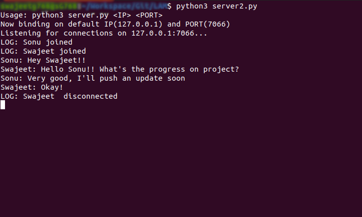
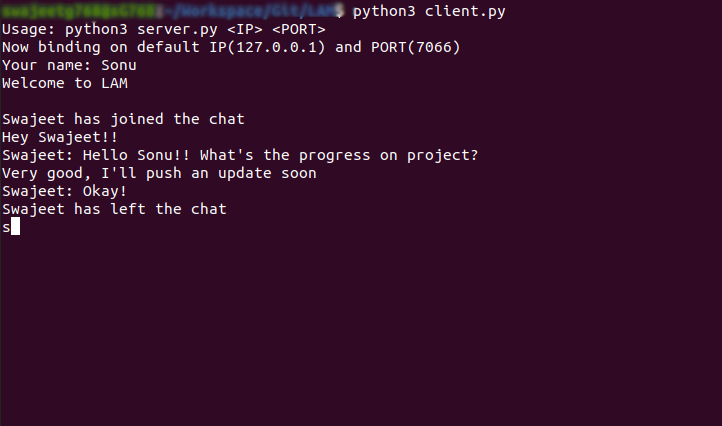
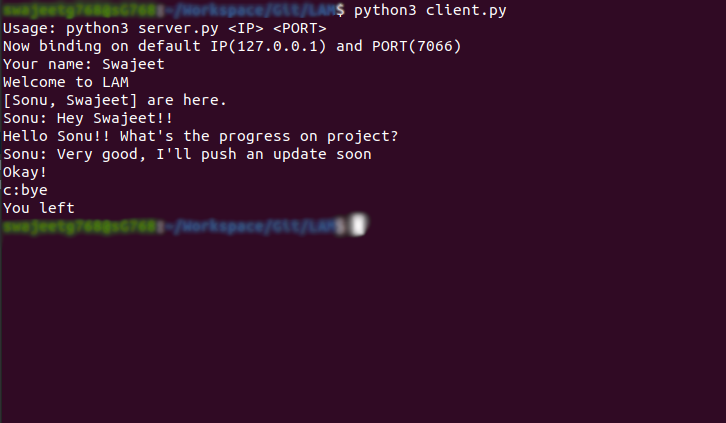

# LAM- Local Area Messenger

## Team Members
- Sonu Kumar
  - Roll No: 19107766
  - ID: [SonuKumar81800](https://github.com/SonuKumar81800)
- Swajeet Swarnkar
  - Roll No: 19107770
  - ID: [swapfile3](https://github.com/swapfile3)

## Motivation
We took our previous project which was
[ChatServer](https://github.com/SonuKumar81800/ChatServer), written in Java
by [Sonu Kumar](https://github.com/SonuKumar81800) and Improved by
[Swajeet Swarnkar](https://github.com/swapfile3) and created a Python version of it.

## Abstract Introduction
LAM stands for Local Area Messenger, it's a CLI based Messenger, and
it can be used on LAN (Local Area Network) such as college Wi-Fi or
portable hotspots offered by smartphones or even over internet.

## Software & Hardware Requirements
- Software Requirements:
  - Python 3.8.5 installed
  - Bash Shell on Linux or
  - Command Prompt/Powershell on Windows or
  - Any textual terminal


- Hardware Requirements:
  - A computer capable of running a textual terminal
  - A keyboard


## Methodology/Technology used
- Python: Python is a snake :snake: (It's an interpreted, high-level, general-purpose
  object-oriented programming language)


- Sockets: A socket is one end-point of a two-way communication link between
  two programs running on the network.
  
  
  
  *Courtesy: Oracle*


- Threads: A Thread of execution is the smallest sequence of programmed
  instruction that can be managed individually by a scheduler.


## Usage
- Server: A server must be running before any client connection
  ```
  $ python server2.py
  ```
  or
  ```
  $ python server2.py <IP> <PORT>
  ```
  for example
  ```
  $ python server2.py 127.0.0.1 7066
  ```


- Client: A client can connect to a server as-
  ```
  $ python client.py
  ```
  or
  ```
  $ python client.py <IP> <PORT>
  ```
  for example
  ```
  $ python client.py 127.0.0.1 7066
  ```


## Results Snapshot
  

  

  
  

## Conclusion
We've developed a lightweight application which can be used to chat over LAN.

## Future Scope
Future updates could implement GUI which will ease the use of this application.

## References
- [Python](https://python.org)
- [LAN](https://en.wikipedia.org/wiki/Local_area_network)
- [Bash Shell](https://en.wikipedia.org/wiki/Bash_(Unix_shell))
- [Command Prompt](https://en.wikipedia.org/wiki/Cmd.exe)
- [Powershell](https://docs.microsoft.com/en-us/powershell)
